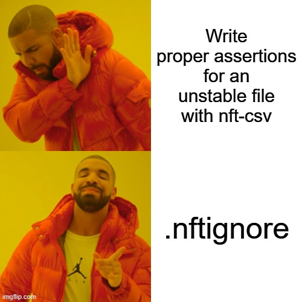

# Functions usage

## Snapshot functions

The plugin adds the following functions to assist with managing pipeline-level nf-test snapshots:

### `removeNextflowVersion()`

nf-core pipelines create a yml file listing all the versions of the software used in the pipeline.

Here is an example of this file coming from the rnaseq pipeline.

```yaml
UNTAR:
  untar: 1.34
Workflow:
  nf-core/rnaseq: v3.16.0dev
  Nextflow: 24.04.4
```

This function remove the Nextflow version from this yml file, as it is not relevant for the snapshot. Therefore for the purpose of the snapshot, it would consider this to be the contents of the YAML file:

```yaml
UNTAR:
  untar: 1.34
Workflow:
  nf-core/rnaseq: v3.16.0dev
```

Usage:

```groovy
assert snapshot(removeNextflowVersion("$outputDir/pipeline_info/nf_core_rnaseq_software_mqc_versions.yml")).match()
```

The function also supports wildcard patterns in file paths, which is useful when the exact filename may vary:

```groovy
assert snapshot(removeNextflowVersion("$outputDir/pipeline_info/*_versions.yml")).match()
```

The only argument is the path to the file (or wildcard pattern) which must match a versions file in YAML format as per the nf-core standard. When using wildcards, all matching files will be processed and their results merged together.

**Note:** The returned YAML structure will have all keys sorted alphabetically at both the top level and within nested sections for consistent, predictable output.

### `removeFromYamlMap()`

Remove any key or entire section from a YAML file. This function supports two usage patterns and also supports wildcard patterns in file paths.

#### Remove a specific subkey (3 arguments)

Remove a specific subkey from within a section:

```groovy
removeFromYamlMap("file.yml", "Workflow", "Nextflow")
```

**Example input:**

```yaml
UNTAR:
  untar: 1.34
Workflow:
  nf-core/rnaseq: v3.16.0dev
  Nextflow: 24.04.4
```

**Result:** Only the "Nextflow" subkey is removed from "Workflow"

```yaml
UNTAR:
  untar: 1.34
Workflow:
  nf-core/rnaseq: v3.16.0dev
```

#### Remove an entire section (2 arguments)

Remove an entire top-level section:

```groovy
removeFromYamlMap("file.yml", "Workflow")
```

**Example input:**

```yaml
UNTAR:
  untar: 1.34
Workflow:
  nf-core/rnaseq: v3.16.0dev
  Nextflow: 24.04.4
Workflow2:
  some: value
```

**Result:** The entire "Workflow" section is removed

```yaml
UNTAR:
  untar: 1.34
Workflow2:
  some: value
```

#### Wildcard support

Both usage patterns support wildcard patterns in the file path:

```groovy
// Remove specific subkey with wildcard
removeFromYamlMap("$outputDir/pipeline_info/*_versions.yml", "Workflow", "Nextflow")

// Remove entire section with wildcard
removeFromYamlMap("$outputDir/pipeline_info/*_versions.yml", "Workflow")
```

#### Usage in tests

```groovy
// Remove specific subkey
assert snapshot(removeFromYamlMap("$outputDir/pipeline_info/nf_core_pipeline_software_mqc_versions.yml", "Workflow", "Nextflow")).match()

// Remove entire section
assert snapshot(removeFromYamlMap("$outputDir/pipeline_info/nf_core_pipeline_software_mqc_versions.yml", "Workflow2")).match()

// Using wildcards
assert snapshot(removeFromYamlMap("$outputDir/pipeline_info/*_versions.yml", "Workflow", "Nextflow")).match()
```

**Arguments:**

- First argument: Path to the YAML file (supports wildcard patterns like `*` and `?`)
- Second argument: The top-level key (section name)
- Third argument (optional): The subkey to remove. If omitted, the entire section is removed.

**Notes:**

- When using wildcard patterns, all matching files will be processed and their results merged together.
- The returned YAML structure will have all keys sorted alphabetically at both the top level and within nested sections for consistent, predictable output.

### `getAllFilesFromDir()`

:::warning
This function requires absolute paths and does not support relative paths to `params.outdir`.
Assign the nf-test `outputDir` variable to `params.outdir` when calling this function.
cf [nf-test/docs](https://www.nf-test.com/docs/testcases/global_variables/#outputdir)

```groovy
  when {
    params {
      outdir = "$outputDir" // Use nf-test global variable to output dir
    }
  }
```

:::

This function generates a list of all the contents within a directory (and subdirectories), additionally allowing for the inclusion or exclusion of specific files using glob patterns.

- The first argument is the directory path to screen for file paths (e.g. a  pipeline's `outdir` ).
- The second argument is a boolean indicating whether to include subdirectory names in the list.
- The third argument is a _list_ of glob patterns to exclude.
- The fourth argument is a _file_ containing additional glob patterns to exclude.
- The fifth argument is a _list_ of glob patterns to include.
- The sixth argument is a boolean indicating whether to output relative paths.

In this example, below are the files produced by a pipeline:

```bash
results/
├── pipeline_info
│   └── execution_trace_2024-09-30_13-10-16.txt
└── stable
    ├── stable_content.txt
    └── stable_name.txt

2 directories, 3 files
```

One file has stable content and a stable name (`stable_content.txt`), and one file has unstable contents but a stable name (`stable_name.txt`).
The last file (`execution_trace_2024-09-30_13-10-16.txt`) has no stable content nor a stable name, as its name is based on the date and time of the pipeline execution.

We aim to snapshot files with stable content, and stable names (for both files and directories), but excluding the completely unstable file.

First, we will specify the following two variables that we will pass to the nf-test snapshot function:

- The `stable_name` variable contains a list of all files and directories, excluding those matching the glob pattern `pipeline_info/execution_*.{html,txt}` (i.e., the unstable file).
- The `stable_content` variable contains a list of all files, excluding those that match the two glob patterns: `pipeline_info/execution_*.{html,txt}` and `**/stable_name.txt`.
  - The latter is specified in the `tests/getAllFilesFromDir/.nftignore` file.

```groovy
def stable_name    = getAllFilesFromDir(params.outdir, true, ['pipeline_info/execution_*.{html,txt}'], null, ['*', '**/*'])
def stable_content = getAllFilesFromDir(params.outdir, false, ['pipeline_info/execution_*.{html,txt}'], 'tests/getAllFilesFromDir/.nftignore', ['*', '**/*'])
```

Secondly, we need to supply these two variables to the nf-test snapshot assrtion.
The list of files in `stable_content` can be supplied to the snapshot directly, and nf-test will include the md5sum hash of the file contents.
For the list of stable file names with unstable contents, we can use `stable_name*.name`, to just extract just _name_ of every file in the list for comparison (i.e., without generating the md5sum hash).

```groovy
def stable_name    = getAllFilesFromDir(params.outdir, true, ['pipeline_info/execution_*.{html,txt}'], null, ['*', '**/*'])
def stable_content = getAllFilesFromDir(params.outdir, false, ['pipeline_info/execution_*.{html,txt}'], 'tests/getAllFilesFromDir/.nftignore', ['*', '**/*'])
assert snapshot(
  stable_content,
  stable_name*.name,
).match()
```

`getAllFilesFromDir()` also supports named parameters:

```groovy
def stable_name       = getAllFilesFromDir(params.outdir, ignore: ['pipeline_info/execution_*.{html,txt}'])
def stable_name_again = getAllFilesFromDir(params.outdir, include: ['stable/*'])
def stable_content    = getAllFilesFromDir(params.outdir, includeDir: false, ignore: ['pipeline_info/execution_*.{html,txt}'], ignoreFile: 'tests/getAllFilesFromDir/.nftignore')
```



### `getRelativePath()`

:::warning
This function requires absolute paths and does not support relative paths to `params.outdir`.
Assign the nf-test `outputDir` variable to `params.outdir` when calling this function.
cf [nf-test/docs](https://www.nf-test.com/docs/testcases/global_variables/#outputdir)

```groovy
  when {
    params {
      outdir = "$outputDir" // Use nf-test global variable to output dir
    }
  }
```

:::

This function is used to get the relative path from a list of files compared to a given directory.

```bash
results/
├── pipeline_info
│   └── execution_trace_2024-09-30_13-10-16.txt
└── stable
    ├── stable_content.txt
    └── stable_name.txt

2 directories, 3 files
```

Following the previous example, we want to get the relative path of the stable paths in the `results` directory.

```groovy
def stable_name    = getAllFilesFromDir(params.outdir, true, ['pipeline_info/execution_*.{html,txt}'], null )
```

The `stable_name` variable contains the list of stable files and folders in the `results` directory.

```groovy
assert snapshot(
  getRelativePath(stable_name, outputDir)
).match()
```

By using `getRelativePath()` we generate in the snapshot:

```text
"content": [
    [
        "pipeline_info",
        "stable",
        "stable/stable_content.txt",
        "stable/stable_name.txt"
    ]
]
```

A reduced list can be generated by using `getAllFilesFromDir()` without including the folders in the output.

```text
"content": [
    [
        "stable/stable_content.txt",
        "stable/stable_name.txt"
    ]
]
```

Without using `getRelativePath()` and by using `*.name` to capture the file names, only a flat structure would be generated, as shown below:

```text
"content": [
    [
        "pipeline_info",
        "stable",
        "stable_content.txt",
        "stable_name.txt"
    ]
]
```

`getAllFilesFromDir()` named parameters `relative` can also be used to combine the two functions:

```groovy
def stable_name       = getAllFilesFromDir(params.outdir, relative: true, ignore: ['pipeline_info/execution_*.{html,txt}'] )
def stable_name_again = getAllFilesFromDir(params.outdir, relative: true, include: ['stable/*'] )
```

### `listToMD5()`

This function takes a list of values as input and converts the sequence to a MD5 hash. All values in the list should be of a type that can be converted to a string, otherwise the function will fail.

A common use case for this function could be to read a file, remove all unstable lines from it and regerenate an MD5 hash.

## Dependency management

The plugin also adds the following functions to manage dependences of tests on nf-core components, in situations where they may not otherwise be available (for example, writing tests for cross-organisational subworkflows in non-nf-core repositories).

### `nfcoreInitialise()` - set up a temporary nf-core library

In a setup block, use the `nfcoreInitialise()` function to initialise a temporary nf-core library to install modules into. This function takes the path to the location to set up the library as an argument. It is recommended to use a location inside `launchDir` as this will initialise a test-specific library.

```groovy
setup {
    nfcoreInitialise("${launchDir}/library")
}
```

### `nfcoreInstall()` - Install modules to a temporary library

Use the `nfcoreInstall()` function to install nf-core modules in a temporary library. This function takes the path to the library and either a list of strings, each with an nf-core module name in `tool/subtool` format, or a list of maps, with the keys `name`, `sha`, and `remote` (both `sha` and `remote` are optional).

```groovy
setup {
    nfcoreInitialise("${launchDir}/library")
    nfcoreInstall("${launchDir}/library", ["minimap2/index"])
    nfcoreInstall(
      "${launchDir}/library",
        [
          [
            name: "minimap2/align",
            sha: "5850432aab24a1924389b660adfee3809d3e60a9"
          ],
          [
            name: "fastqc",
            remote: "https://github.com/nf-core-test/modules.git"
          ],
          [
            name: "prokka",
            sha: "9627f4367b11527194ef14473019d0e1a181b741"
            remote: "https://github.com/nf-core-test/modules.git"
          ],
        ]
    )
}
```

### `nfcoreLink()` - Link a temporary library to your modules directory

Use the `nfcoreLink()` function to link a library to your module library. This function takes two arguments, the path to a temporary library, and the location where the modules in the library should be temporarily linked (e.g. `${baseDir}/modules/nf-core`):

```groovy
setup {
    nfcoreInitialise("${launchDir}/library")
    nfcoreInstall("${launchDir}/library", ["minimap2/index", "minimap2/align"])
    nfcoreLink("${launchDir}/library", "${baseDir}/modules/")
}
```

This creates a symlink to the modules directory of your temporary library at `${baseDir}/modules/nf-core`. Using this location, you can refer to the nf-core modules as if they were installed as normal in your tests.

### `nfcoreUnlink()` - Unlink a temporary library from your modules directory

To unlink a temporary library after the test has completed, use the `nfcoreUnlink()` function. It takes the same arguments as `nfcoreLink()`, and recursively removes all symlinks pointing to the temporary library.

```groovy
setup {
    nfcoreInitialise("${launchDir}/library")
    nfcoreInstall("${launchDir}/library", ["minimap2/index", "minimap2/align"])
    nfcoreLink("${launchDir}/library", "${baseDir}/modules/")

    run("MINIMAP2_INDEX") {
        script "${baseDir}/modules/nf-core/minimap2/index/main.nf
        ...
    }
}

when {
    ...
}

then {
    ...
}

cleanup {
  nfcoreUnlink("${launchDir}/library", "${baseDir}/modules/")
}
```

### `nfcoreDeleteLibrary()` - Completely delete a temporary library

You can use the `nfcoreDeleteLibrary()` function to completely remove the temporary library, if desired.

```groovy

setup {
    nfcoreInitialise("${launchDir}/library")
    nfcoreInstall("${launchDir}/library", ["minimap2/index", "minimap2/align"])
    nfcoreLink("${launchDir}/library", "${baseDir}/modules/")

    run("MINIMAP2_INDEX") {
        script "${baseDir}/modules/nf-core/minimap2/index/main.nf
        ...
    }
}

when {
    ...
}

then {
    ...
}

cleanup {
    nfcoreDeleteLibrary("${launchDir}/library")
}
```
