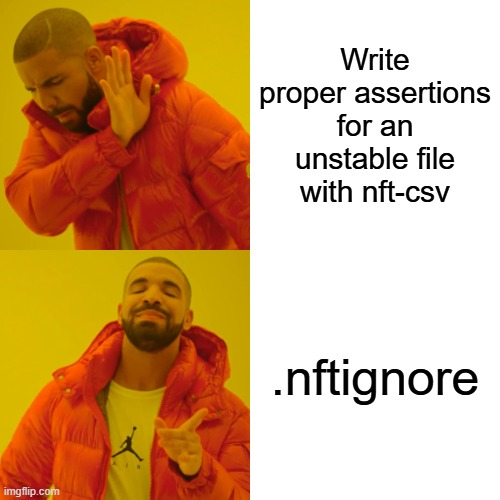

# Functions usage

## Snapshot functions

Functions for managing pipeline-level nf-test snapshots:

### `removeNextflowVersion()`

nf-core pipelines create a YAML file listing software versions. This function removes the Nextflow version from that file, since it changes between runs and makes snapshots unstable.

Example input (`nf_core_rnaseq_software_mqc_versions.yml`):

```yaml
UNTAR:
  untar: 1.34
Workflow:
  nf-core/rnaseq: v3.16.0dev
  Nextflow: 24.04.4
```

After applying `removeNextflowVersion()`:

```yaml
UNTAR:
  untar: 1.34
Workflow:
  nf-core/rnaseq: v3.16.0dev
```

Usage:

```groovy
assert snapshot(removeNextflowVersion("$outputDir/pipeline_info/nf_core_rnaseq_software_mqc_versions.yml")).match()
```

Supports wildcard patterns when the filename varies:

```groovy
assert snapshot(removeNextflowVersion("$outputDir/pipeline_info/*_versions.yml")).match()
```

The argument is a path (or wildcard pattern) matching a versions file in YAML format per the nf-core standard. Wildcards merge all matching files.

**Note:** Returned YAML has keys sorted alphabetically at all levels for consistent output.

### `removeFromYamlMap()`

Remove a key or entire section from a YAML file. Supports two patterns and wildcard file paths.

#### Remove a specific subkey (3 arguments)

```groovy
removeFromYamlMap("file.yml", "Workflow", "Nextflow")
```

Input:

```yaml
UNTAR:
  untar: 1.34
Workflow:
  nf-core/rnaseq: v3.16.0dev
  Nextflow: 24.04.4
```

Result: the "Nextflow" subkey is removed from "Workflow":

```yaml
UNTAR:
  untar: 1.34
Workflow:
  nf-core/rnaseq: v3.16.0dev
```

#### Remove an entire section (2 arguments)

```groovy
removeFromYamlMap("file.yml", "Workflow")
```

Input:

```yaml
UNTAR:
  untar: 1.34
Workflow:
  nf-core/rnaseq: v3.16.0dev
  Nextflow: 24.04.4
Workflow2:
  some: value
```

Result: the entire "Workflow" section is removed:

```yaml
UNTAR:
  untar: 1.34
Workflow2:
  some: value
```

#### Wildcard support

Both patterns support wildcards in the file path:

```groovy
// Remove specific subkey with wildcard
removeFromYamlMap("$outputDir/pipeline_info/*_versions.yml", "Workflow", "Nextflow")

// Remove entire section with wildcard
removeFromYamlMap("$outputDir/pipeline_info/*_versions.yml", "Workflow")
```

#### Usage in tests

```groovy
// Remove specific subkey
assert snapshot(removeFromYamlMap("$outputDir/pipeline_info/nf_core_pipeline_software_mqc_versions.yml", "Workflow", "Nextflow")).match()

// Remove entire section
assert snapshot(removeFromYamlMap("$outputDir/pipeline_info/nf_core_pipeline_software_mqc_versions.yml", "Workflow2")).match()

// Using wildcards
assert snapshot(removeFromYamlMap("$outputDir/pipeline_info/*_versions.yml", "Workflow", "Nextflow")).match()
```

**Arguments:**

- First: Path to the YAML file (supports `*` and `?` wildcards)
- Second: Top-level key (section name)
- Third (optional): Subkey to remove. Omit to remove the entire section.

**Notes:**

- Wildcards merge all matching files.
- Returned YAML has keys sorted alphabetically at all levels.

### `getAllFilesFromPath()`

:::warning
When using this function with nf-test outputs, prefer assigning the nf-test `outputDir` variable to `params.outdir`.
Relative local paths may work, but using `$outputDir` is the recommended nf-test setup for predictable path resolution.
See [nf-test docs](https://www.nf-test.com/docs/testcases/global_variables/#outputdir)

```groovy
  when {
    params {
      outdir = "$outputDir" // Use nf-test global variable as output dir
    }
  }
```

:::

Works for **local paths and S3 paths** (`s3://`). Local paths are walked using Java NIO; S3 paths are listed using the AWS CLI (`aws s3 ls --recursive`).

Returns a **sorted list of relative `String` paths** (relative to the given root).

Supported named parameters:

| Option          | Type           | Default       | Description                                                                                 |
| --------------- | -------------- | ------------- | ------------------------------------------------------------------------------------------- |
| `ignore`        | `List<String>` | `[]`          | Glob patterns to exclude                                                                    |
| `include`       | `List<String>` | `["**", "*"]` | Glob patterns to include                                                                    |
| `includeDir`    | `Boolean`      | `false`       | Also emit directory entries                                                                 |
| `ignoreFile`    | `String`       | —             | Path to a local file containing additional ignore globs (one per line)                      |
| `noSignRequest` | `Boolean`      | `false`       | Pass `--no-sign-request` to the AWS CLI when listing a public S3 bucket without credentials |

#### Local usage

```groovy
// All files, ignoring unstable trace files
def stable_files = getAllFilesFromPath(params.outdir, ignore: ['pipeline_info/execution_*.{html,txt}'])

// Include directory entries, scoped to a sub-path
def with_dirs = getAllFilesFromPath(params.outdir, includeDir: true, include: ['stable/*'])

// Use an .nftignore file for additional exclusions
def stable_content = getAllFilesFromPath(
    params.outdir,
    ignore: ['pipeline_info/execution_*.{html,txt}'],
    ignoreFile: 'tests/mytest/.nftignore'
)

assert snapshot(stable_files, with_dirs, stable_content).match()
```

#### S3 usage

```groovy
// Requires the AWS CLI to be available on the path
def s3_files = getAllFilesFromPath("s3://my-bucket/results/", ignore: ['pipeline_info/**'])
assert snapshot(s3_files).match()
```

AWS credentials are resolved by the AWS CLI (environment variables, `~/.aws/credentials`, IAM roles, etc.).

:::note
Support for GCS (`gs://`) and Azure Blob (`az://`) paths is planned for a future version.
:::

### `downloadFromS3()`

Downloads a single file from S3 to a temporary local directory and returns the local path. The destination mirrors the S3 key structure under a plugin-specific temp directory, so repeated calls for the same URI are idempotent.

Requires the AWS CLI on the path.

```groovy
def local_file = downloadFromS3("s3://my-bucket/path/to/file.vcf.gz")
assert snapshot(path(local_file.toString())).match()
```

Supported named parameters:

| Option          | Type      | Default | Description                                                           |
| --------------- | --------- | ------- | --------------------------------------------------------------------- |
| `noSignRequest` | `Boolean` | `false` | Pass `--no-sign-request` to the AWS CLI for publicly readable buckets |

```groovy
// Download a file from a public bucket
def local_file = downloadFromS3("s3://my-public-bucket/data/sample.vcf.gz", noSignRequest: true)

// Combine with getAllFilesFromPath to download and snapshot specific files
def vcf_files = getAllFilesFromPath("s3://my-bucket/results/", noSignRequest: true, include: ['**/*.vcf.gz'])
assert snapshot(
    vcf_files.collect { relPath ->
        path(downloadFromS3("s3://my-bucket/results/${relPath}", noSignRequest: true).toString())
    }
).match()
```

### `getAllFilesFromDir()`

:::caution
**Deprecated.** Use [`getAllFilesFromPath()`](#getallfilesfrompath) instead. It provides the same functionality with S3 support.
:::

:::warning
This function requires absolute paths and does not support relative paths to `params.outdir`.
Assign the nf-test `outputDir` variable to `params.outdir` when calling this function.
cf [nf-test/docs](https://www.nf-test.com/docs/testcases/global_variables/#outputdir)

```groovy
  when {
    params {
      outdir = "$outputDir" // Use nf-test global variable to output dir
    }
  }
```

:::

Lists all contents within a directory (and subdirectories), with glob-based inclusion/exclusion.

Arguments:

1. Directory path (e.g. a pipeline's `outdir`)
2. Boolean: include subdirectory names in the list
3. List of glob patterns to exclude
4. File containing additional glob patterns to exclude
5. List of glob patterns to include
6. Boolean: output relative paths

Example pipeline output:

```bash
results/
├── pipeline_info
│   └── execution_trace_2024-09-30_13-10-16.txt
└── stable
    ├── stable_content.txt
    └── stable_name.txt

2 directories, 3 files
```

`stable_content.txt` has stable content and a stable name. `stable_name.txt` has unstable content but a stable name. `execution_trace_2024-09-30_13-10-16.txt` is completely unstable (name changes with each run).

To snapshot files with stable content and stable names while excluding the unstable file:

```groovy
def stable_name    = getAllFilesFromDir(params.outdir, true, ['pipeline_info/execution_*.{html,txt}'], null, ['*', '**/*'])
def stable_content = getAllFilesFromDir(params.outdir, false, ['pipeline_info/execution_*.{html,txt}'], 'tests/getAllFilesFromDir/.nftignore', ['*', '**/*'])
```

Pass these to the snapshot. `stable_content` goes directly (nf-test computes md5sums). Use `stable_name*.name` to extract just file names without md5sums:

```groovy
def stable_name    = getAllFilesFromDir(params.outdir, true, ['pipeline_info/execution_*.{html,txt}'], null, ['*', '**/*'])
def stable_content = getAllFilesFromDir(params.outdir, false, ['pipeline_info/execution_*.{html,txt}'], 'tests/getAllFilesFromDir/.nftignore', ['*', '**/*'])
assert snapshot(
  stable_content,
  stable_name*.name,
).match()
```

Named parameters:

```groovy
def stable_name       = getAllFilesFromDir(params.outdir, ignore: ['pipeline_info/execution_*.{html,txt}'])
def stable_name_again = getAllFilesFromDir(params.outdir, include: ['stable/*'])
def stable_content    = getAllFilesFromDir(params.outdir, includeDir: false, ignore: ['pipeline_info/execution_*.{html,txt}'], ignoreFile: 'tests/getAllFilesFromDir/.nftignore')
```



### `getRelativePath()`

:::warning
This function requires absolute paths and does not support relative paths to `params.outdir`.
Assign the nf-test `outputDir` variable to `params.outdir` when calling this function.
cf [nf-test/docs](https://www.nf-test.com/docs/testcases/global_variables/#outputdir)

```groovy
  when {
    params {
      outdir = "$outputDir" // Use nf-test global variable to output dir
    }
  }
```

:::

Converts a list of absolute file paths to paths relative to a given directory.

```bash
results/
├── pipeline_info
│   └── execution_trace_2024-09-30_13-10-16.txt
└── stable
    ├── stable_content.txt
    └── stable_name.txt

2 directories, 3 files
```

```groovy
def stable_name    = getAllFilesFromDir(params.outdir, true, ['pipeline_info/execution_*.{html,txt}'], null )
```

```groovy
assert snapshot(
  getRelativePath(stable_name, outputDir)
).match()
```

Output:

```text
"content": [
    [
        "pipeline_info",
        "stable",
        "stable/stable_content.txt",
        "stable/stable_name.txt"
    ]
]
```

Without folders:

```text
"content": [
    [
        "stable/stable_content.txt",
        "stable/stable_name.txt"
    ]
]
```

Without `getRelativePath()` (using `*.name`), you get a flat structure:

```text
"content": [
    [
        "pipeline_info",
        "stable",
        "stable_content.txt",
        "stable_name.txt"
    ]
]
```

The `relative` named parameter on `getAllFilesFromDir()` combines both operations:

```groovy
def stable_name       = getAllFilesFromDir(params.outdir, relative: true, ignore: ['pipeline_info/execution_*.{html,txt}'] )
def stable_name_again = getAllFilesFromDir(params.outdir, relative: true, include: ['stable/*'] )
```

### `getAllFilesFromChannel()`

Extracts absolute file paths from Nextflow channel outputs. Collects and flattens nested structures, filters out metadata maps, and returns only paths (strings starting with "/").

Before:

```groovy
file(process.out.zip[0][3][0]).name,
file(process.out.zip[0][3][1]).name,
```

Or the more generic pattern:

```groovy
process.out.html.collect().flatten().findAll { !(it instanceof Map) && it.startsWith("/") }
```

After:

```groovy
getAllFilesFromChannel(process.out.html)
```

#### Basic usage

```groovy
test("Process output test") {
    then {
        assert snapshot(
            getAllFilesFromChannel(process.out.html),
            getAllFilesFromChannel(process.out.zip)
        ).match()
    }
}
```

#### Usage with file names

Combine with Groovy's `.collect()` to extract file names:

```groovy
test("Process output test") {
    then {
        assert snapshot(
            // Get just the file names
            getAllFilesFromChannel(process.out.html).collect { f -> file(f).name },
            // Get the full paths
            getAllFilesFromChannel(process.out.html)
        ).match()
    }
}
```

### `listToMD5()`

Converts a list of values to an MD5 hash. All values must be convertible to strings.

A common use case: read a file, remove unstable lines, then regenerate the MD5 hash.

### `filterNextflowOutput()`

Filters Nextflow stdout/stderr to remove variable content that makes snapshots unstable. Censors timestamps, process hashes, file paths, version messages, and empty lines.

```groovy
// Basic usage
def filtered_stdout = filterNextflowOutput(workflow.stdout)
def filtered_stderr = filterNextflowOutput(workflow.stderr)
def filtered_both = filterNextflowOutput(workflow.stdout + workflow.stderr)

// Preserve ANSI escape codes (stripped by default)
def filtered_with_ansi = filterNextflowOutput(workflow.stdout + workflow.stderr, keepAnsi: true)

// Ignore lines containing specific strings
def filtered_with_ignore = filterNextflowOutput(workflow.stdout, ignore: ["Submitted process"])

// Include only lines containing specific strings
def filtered_with_include = filterNextflowOutput(workflow.stdout, include: ["Submitted process"])
```

These line types are sorted alphabetically after censoring:

- `Staging foreign file` messages
- `Submitted process` messages
- `Check * file for details` messages
- `WARN:` messages
- `ERROR:` messages

Set `sorted: false` to disable sorting (not recommended; causes snapshot failures).

All other lines keep their original order.

Example: process submissions like

```bash
[57/0d391c] Submitted process > FASTQC (sample_2)
[6f/3be732] Submitted process > FASTQC (sample_1)
[6d/0082ab] Submitted process > FASTQC (sample_3)
```

become:

```bash
[PROCESS_HASH] Submitted process > FASTQC (sample_1)
[PROCESS_HASH] Submitted process > FASTQC (sample_2)
[PROCESS_HASH] Submitted process > FASTQC (sample_3)
```

ANSI escape codes are stripped by default to prevent garbled text in snapshots. Set `keepAnsi: true` to preserve them.

Filtered patterns:

- Empty lines (removed entirely)
- Timestamps (replaced with `[TIMESTAMP]`)
- Process hashes (replaced with `[PROCESS_HASH]`)
- File paths (replaced with `[PATH]`), including common ENV variables: `HOME`, `NFT_WORKDIR`, `NXF_CACHE_DIR`, `NXF_CONDA_CACHEDIR`, `NXF_HOME`, `NXF_SINGULARITY_CACHEDIR`, `NXF_SINGULARITY_LIBRARYDIR`, `NXF_TEMP`, `NXF_WORK`
- Version information: "Nextflow X.Y.Z is available" messages removed, version strings replaced with `[VERSION]`

Example test:

```groovy
test("my_pipeline_test") {

    when {
        params {
            outdir = "$outputDir"
        }
    }

        then {
        assert snapshot(
            filterNextflowOutput(workflow.stdout + workflow.stderr)
        ).match()
    }
}
```

## Dependency management

Functions for managing test dependencies on nf-core components. Useful when writing tests for cross-organisational subworkflows in non-nf-core repositories.

### `nfcoreInitialise()` - set up a temporary nf-core library

Creates a temporary nf-core library for module installation. Pass the path to the library location. Use a location inside `.nf-test/` to keep it contained, or `${launchDir}` for a test-specific library.

```groovy
setup {
    nfcoreInitialise("${launchDir}/library")
}
```

### `nfcoreInstall()` - Install modules to a temporary library

Installs nf-core modules into a temporary library. Pass the library path and either a list of module names (`tool/subtool` format) or a list of maps with `name`, `sha`, and `remote` keys (`sha` and `remote` are optional).

```groovy
setup {
    nfcoreInitialise("${launchDir}/library")
    nfcoreInstall("${launchDir}/library", ["minimap2/index"])
    nfcoreInstall(
      "${launchDir}/library",
        [
          [
            name: "minimap2/align",
            sha: "5850432aab24a1924389b660adfee3809d3e60a9"
          ],
          [
            name: "fastqc",
            remote: "https://github.com/nf-core-test/modules.git"
          ],
          [
            name: "prokka",
            sha: "9627f4367b11527194ef14473019d0e1a181b741"
            remote: "https://github.com/nf-core-test/modules.git"
          ],
        ]
    )
}
```

A `state/` directory inside the library tracks which modules have been installed. If a state file exists for a module (matching name, sha, and remote), installation is skipped.

### `nfcoreLink()` - Link a temporary library to your modules directory

Symlinks modules from the temporary library into your project's modules directory.

```groovy
setup {
    nfcoreInitialise("${launchDir}/library")
    nfcoreInstall("${launchDir}/library", ["minimap2/index", "minimap2/align"])
    nfcoreLink("${launchDir}/library", "${baseDir}/modules/")
}
```

This creates a symlink at `${baseDir}/modules/nf-core`. Reference nf-core modules from there as if they were installed normally.

### `nfcoreUnlink()` - Unlink a temporary library from your modules directory

Removes all symlinks pointing to the temporary library. Takes the same arguments as `nfcoreLink()`.

```groovy
setup {
    nfcoreInitialise("${launchDir}/library")
    nfcoreInstall("${launchDir}/library", ["minimap2/index", "minimap2/align"])
    nfcoreLink("${launchDir}/library", "${baseDir}/modules/")

    run("MINIMAP2_INDEX") {
        script "${baseDir}/modules/nf-core/minimap2/index/main.nf
        ...
    }
}

when {
    ...
}

then {
    ...
}

cleanup {
  nfcoreUnlink("${launchDir}/library", "${baseDir}/modules/")
}
```

### `nfcoreDeleteLibrary()` - Completely delete a temporary library

Deletes the temporary library and all its contents.

```groovy

setup {
    nfcoreInitialise("${launchDir}/library")
    nfcoreInstall("${launchDir}/library", ["minimap2/index", "minimap2/align"])
    nfcoreLink("${launchDir}/library", "${baseDir}/modules/")

    run("MINIMAP2_INDEX") {
        script "${baseDir}/modules/nf-core/minimap2/index/main.nf
        ...
    }
}

when {
    ...
}

then {
    ...
}

cleanup {
    nfcoreDeleteLibrary("${launchDir}/library")
}
```

### `sanitizeOutput()` - Sanitize process output to create clean snapshots

Cleans process and workflow outputs by removing numbered keys, creating human-readable snapshots.

```groovy
then {
  assert snapshot(sanitizeOutput(process.out)).match()
}
```

Options:

- `unstableKeys`: Snapshot only file names (no md5sum) for these keys. Use for files with unstable content.

```groovy
then {
  assert snapshot(sanitizeOutput(process.out, unstableKeys:["zip"])).match()
}
```

- `ignoreKeys`: Exclude these keys from the snapshot entirely. Use when file names vary between runs.

```groovy
then {
  assert snapshot(sanitizeOutput(process.out, ignoreKeys:["log"])).match()
}
```

- `readsMD5Keys`: Keys containing alignment files (`.bam`, `.sam`, `.cram`). MD5 is computed from reads only, using [`nft-bam`](https://nvnieuwk.github.io/nft-bam/dev/). Add `nft-bam` to `plugins {}` before `nft-utils`. For `.cram` files, pass the reference genome `.fasta` (`.fai` is auto-detected).

```groovy
then {
  assert snapshot(sanitizeOutput(process.out, readsMD5Keys:["bam"])).match()
  assert snapshot(sanitizeOutput(process.out, readsMD5Keys:["bam"], referenceFasta: "https://url/reference.fa")).match() // for cram files
}
```

- `variantsMD5Keys`: Keys containing variant files (`.vcf`, `.vcf.gz`). MD5 is computed from variants only, using [`nft-vcf`](https://github.com/seppinho/nft-vcf). BCF not yet supported. Add `nft-vcf` to `plugins {}` before `nft-utils`.

```groovy
then {
  assert snapshot(sanitizeOutput(process.out, variantsMD5Keys:["vcf"])).match()
}
```

- `csvMD5Keys`: Keys containing flat text tables (`.txt`, `.tsv`, `.csv`). MD5 is computed from normalized CSV: rows and columns sorted, floats rounded to 6 decimals, absolute paths reduced to file/folder names, line endings standardized to `\n`. Use `normalizeCsv(path(process.out.csv[0][1]))` for debugging. Set precision with `csvDoubleDigits` (default: 6).

```groovy
then {
  assert snapshot(sanitizeOutput(process.out, csvMD5Keys:["csv"], csvDoubleDigits: 4)).match()
}
```

- `unstablePatterns` and `ignorePatterns`: Glob patterns matched against each channel value. `unstablePatterns` removes md5sums; `ignorePatterns` excludes files entirely. These patterns should be mutually exclusive. Keys set by `unstableKeys`, `ignoreKeys`, `readsMD5Keys`, and `variantsMD5Keys` are not matched against these patterns.

```groovy
then {
  assert snapshot(sanitizeOutput(process.out, unstablePatterns:["**/*.log"], ignorePatterns:["**/VERSION_*"])).match()
}
```

### `curlAndExtract()` - Download and extract an archive

Downloads an archive with `curl` and extracts it to a destination directory. Supports Zip and Tar archives. Tar compression formats: gzip, gz, bzip2, bz2, xz, lz4, lzma, lzop, zstd. The format is auto-detected from the filename, or pass it explicitly. For compressed Tar, use formats like `"tar.bz2"` or `"tbz2"`.

You are responsible for deleting the data in the `cleanup` phase.

```groovy
setup {
    curlAndExtract("https://www.example.com/pretty_database.zip", "${launchDir}/data_dir")
    curlAndExtract("https://www.example.com/beautiful_database.tar.gz", "${launchDir}/data_dir")
    curlAndExtract("https://www.example.com/secret/data", "${launchDir}/data_dir", "tar.bz2")
}

when {
  params {
    pretty_db_path = "${launchDir}/data_dir/pretty_db"
    beautiful_db_path = "${launchDir}/data_dir/db/beauty_db"
    secret_db_path = "${launchDir}/data_dir/db/secret"
  }
}

cleanup {
    new File("${launchDir}/data_dir").deleteDir()
}
```
